# 📝 Informe — Aplicación 2

**Universidad San Francisco Xavier de Chuquisaca**  
**Asignatura:** Infraestructura, Plataformas Tecnológicas y Redes (SIS313)  
**Docente:** Ing. Marcelo Quispe Ortega  
**Semestre:** 1/2026  
**Integrante:** Melany Shelen Jurado Mamani
**Rol:** APLICACIÓN 2  
**IP SSH:** `192.168.100.177` | **IP VLAN 107:** `192.168.107.4`

---

## 1. Configuración de Red

### 1.1 Configuración IP Estática con VLAN 107

Se editó el archivo de configuración de red:

```bash
sudo nano /etc/netplan/50-cloud-init.yaml
```
> 

Contenido aplicado:

```yaml
network:
  version: 2
  renderer: networkd
  ethernets:
    ens18:
      dhcp4: no
      optional: true
      addresses:
        - "192.168.100.177/24"
      routes:
        - to: default
          via: 192.168.100.1
      nameservers:
        addresses:
          - 8.8.8.8
  vlans:
    vlan107:
      id: 107
      link: ens18
      addresses:
        - "192.168.107.4/29"
```
> 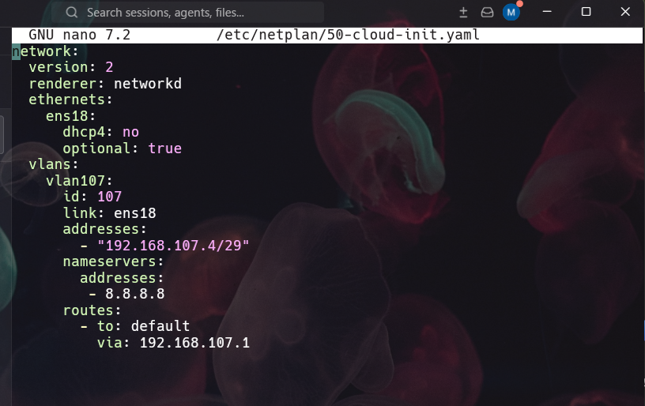

```bash
sudo netplan apply
```
> 

### 1.2 Verificación de Interfaces de Red

```bash
ip addr show
```
> 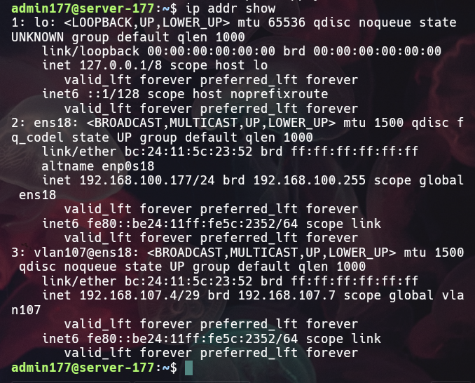

---

### 1.3 Verificación de Conectividad con las demás VMs

```bash
ping -c 3 192.168.107.2   # Proxy - Fernando
ping -c 3 192.168.107.3   # App 1 - Daner
ping -c 3 192.168.107.5   # DB - Limbert
```
> 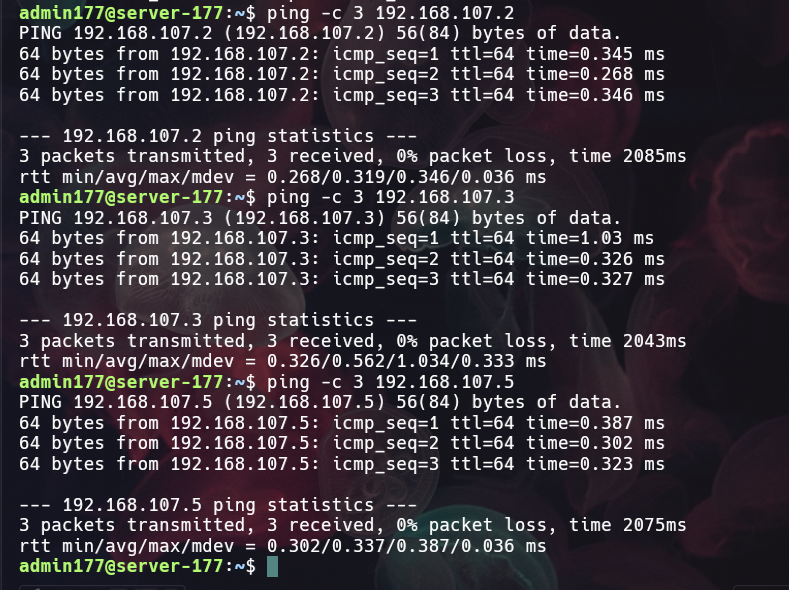

---

## 2. Instalación de Node.js con NVM

```bash
curl -o- https://raw.githubusercontent.com/nvm-sh/nvm/v0.40.3/install.sh | bash
```
> 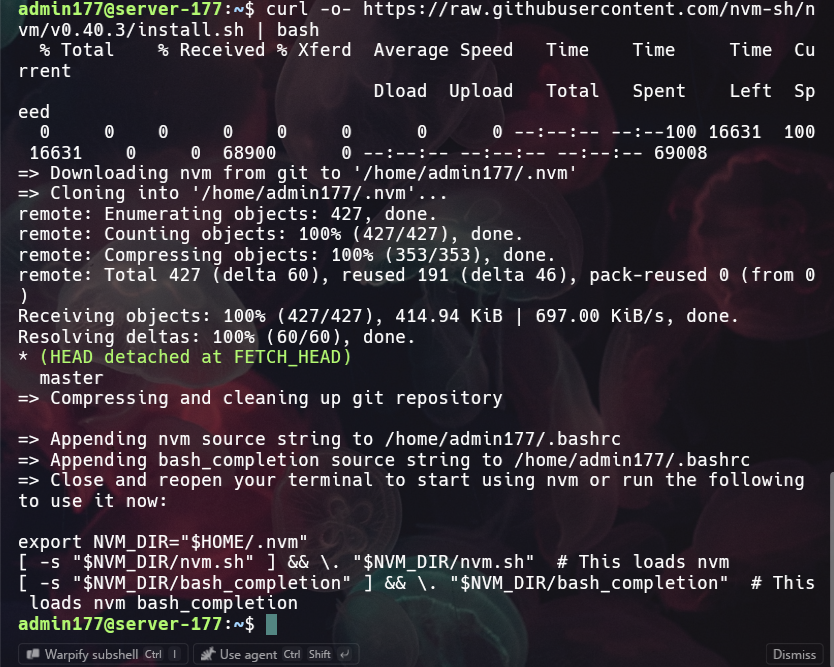

```bash
\. "$HOME/.nvm/nvm.sh"
```
> 

```bash
nvm install 22
```
> 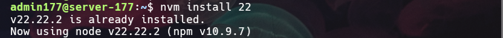

### 2.1 Verificación de Versiones

```bash
node -v
npm -v
```

> 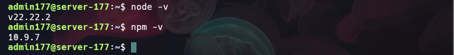

---

## 3. Instalación de PM2

```bash
npm install pm2@latest -g
```
> 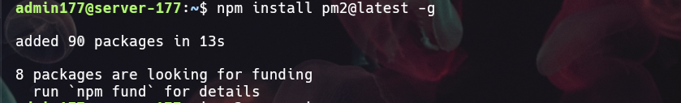

### 3.1 Verificación de PM2

```bash
pm2 --version
```
> 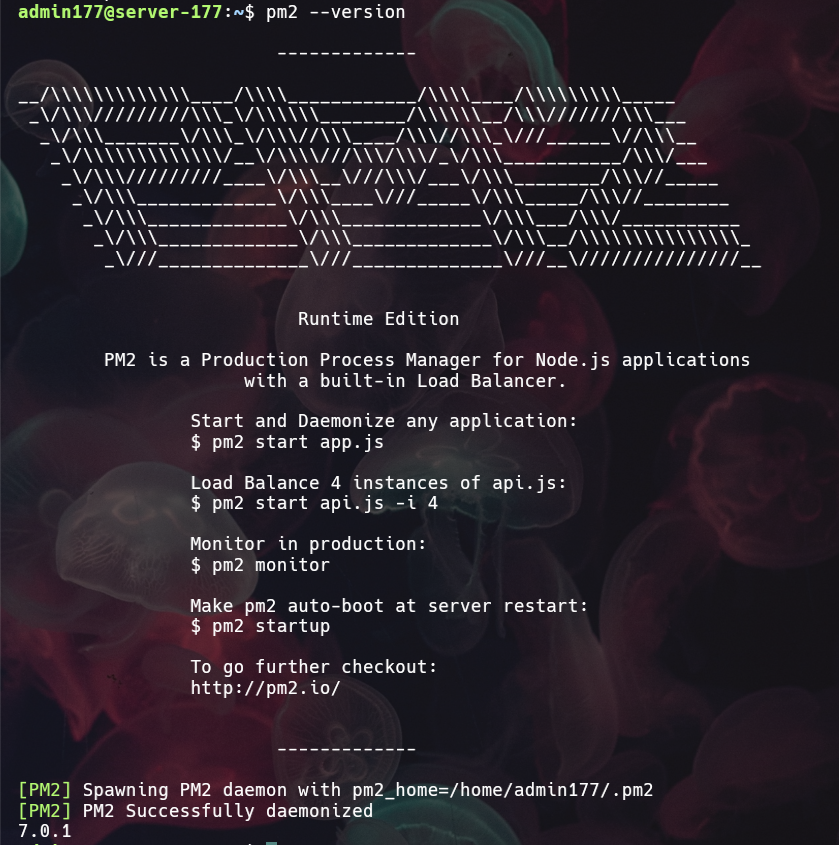

---

## 4. Clonación de la Aplicación

```bash
mkdir ~/apps && cd ~/apps
```
> 

```bash
git clone https://github.com/marceloquispeortega/api-restful-crud-movies app2_3000
```
> 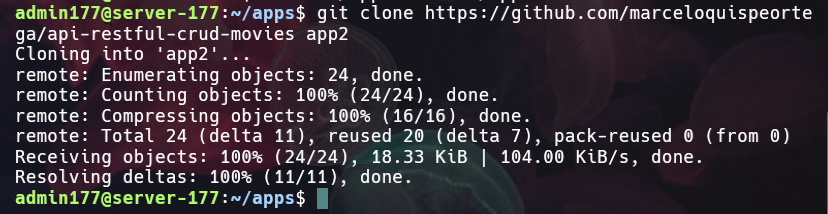

```bash
cd ~/apps/app2 && npm install
```
> 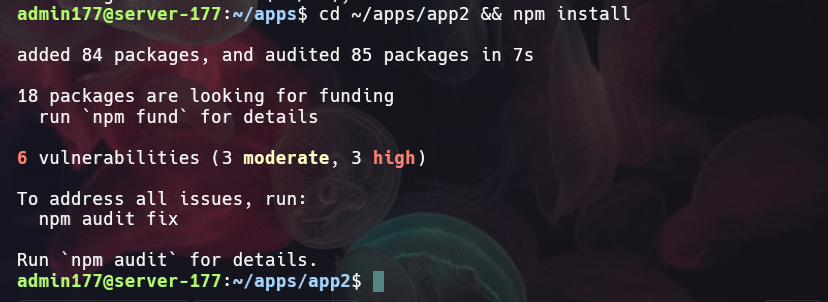

---

## 5. Configuración de Variables de Entorno

```bash
cd ~/apps/app2 && cp .env.example .env
```
> 

```bash
nano ~/apps/app2/.env
```
> 

Contenido aplicado:

```env
PORT=3000
DB_HOST=192.168.107.5
DB_PORT=3306
DB_NAME=db_movies
DB_USER=usr_movies
DB_PASSWORD=secret

```
> 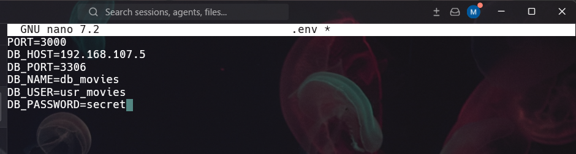

---

## 6. Prueba Manual de la Aplicación

```bash
cd ~/apps/app2 && node app.js
```
> 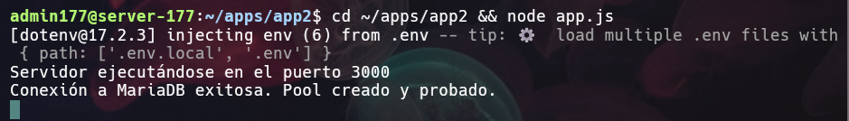

Se detuvo la app con `Ctrl+C` tras verificar el funcionamiento correcto.

---

## 7. Lanzar con PM2

```bash
cd ~/apps/app2 && pm2 start app.js --name app2
```
> 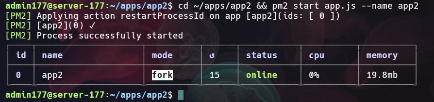

```bash
pm2 startup
```
> 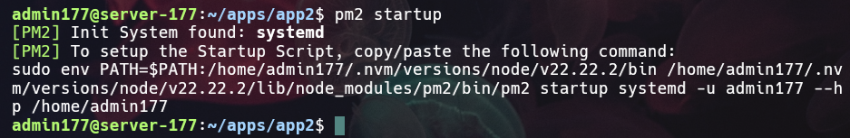

```bash
pm2 save
```
> 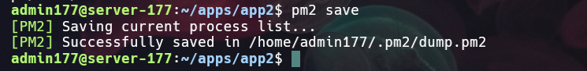

### 7.1 Verificación del Estado en PM2

```bash
pm2 status
```
> 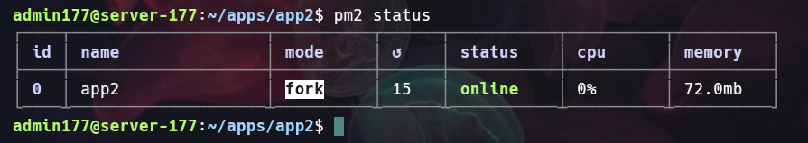

---

## 8. Instalación de Node Exporter

```bash
sudo apt install prometheus-node-exporter -y
```
> 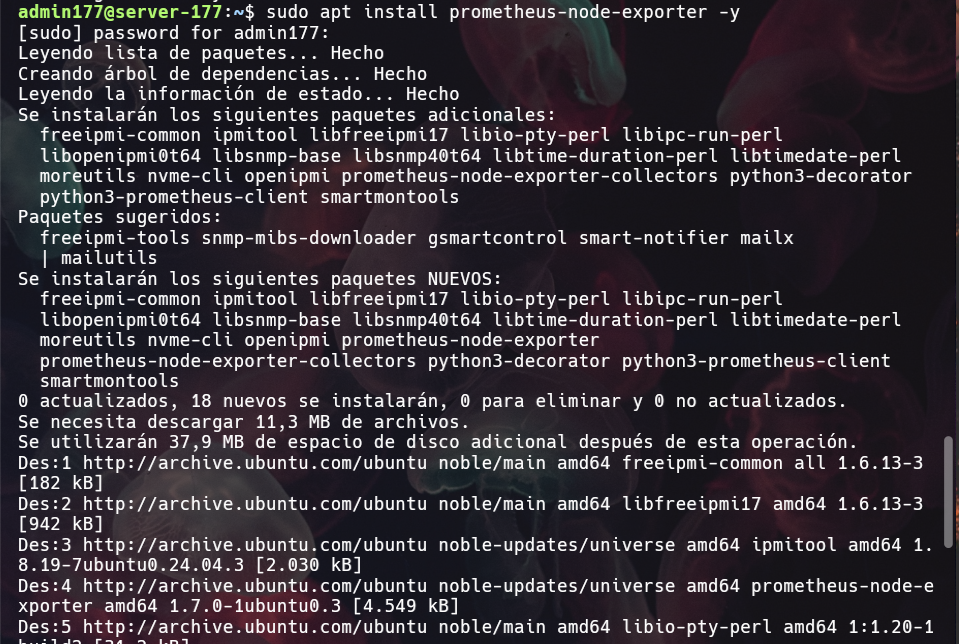

```bash
curl http://localhost:9100/metrics | head -20
```
> 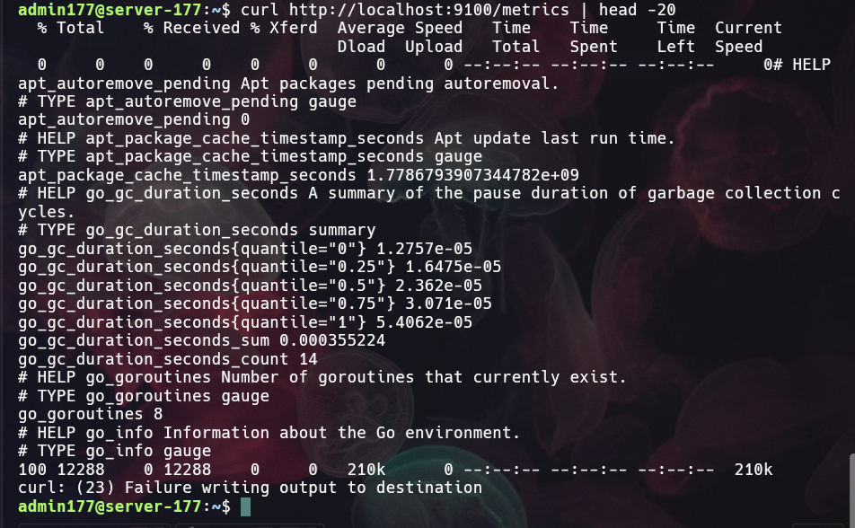

### 8.1 Verificación del Estado de Node Exporter

```bash
sudo systemctl status prometheus-node-exporter
```
> 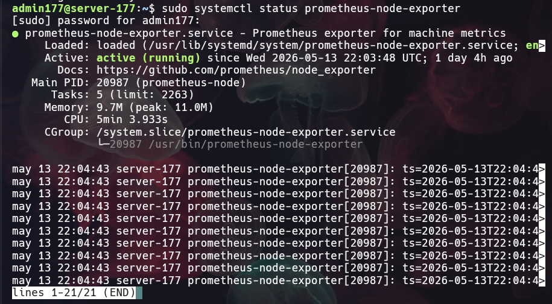

---

## 9. Pruebas de Funcionamiento

### 9.1 Verificación del Endpoint desde la VM

```bash
curl http://localhost:3000/movies
```
> 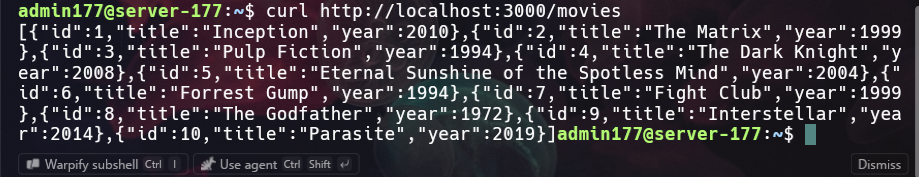

### 9.2 Verificación desde la IP de la VLAN

```bash
curl http://192.168.107.4:3000/movies
```
> 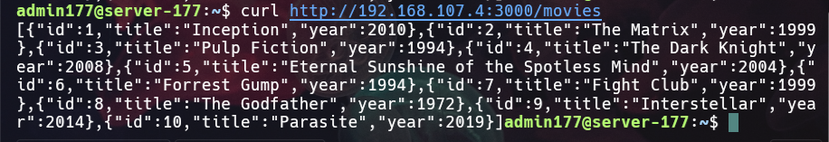

### 9.3 Prueba de Failover

Al solicitar la demostración, se detuvo la App 2 para verificar que el proxy redirige todo el tráfico a App 1:

```bash
pm2 stop app2
```
> 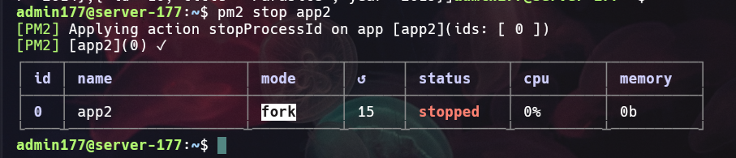
> 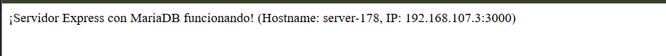

```bash
pm2 start app2
```
> 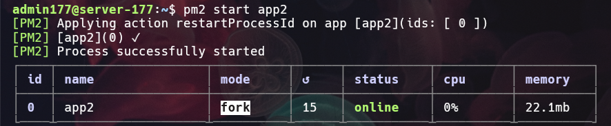
> 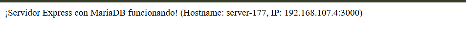

---

## 10. Conclusiones

- Se instaló Node.js v22 mediante NVM y PM2 como gestor de procesos, garantizando que la aplicación se mantenga en ejecución y se reinicie automáticamente ante cualquier fallo.

- Se configuró correctamente el archivo `.env` apuntando a la base de datos centralizada en `192.168.107.5`, logrando una conexión exitosa a MariaDB desde el primer arranque.

- La aplicación responde correctamente en el puerto `3000` y el endpoint `/movies` devuelve los datos esperados desde la base de datos.

- Durante la prueba de failover, al detener App 2, el proxy de Fernando redirigió automáticamente el 100% del tráfico a App 1, confirmando el correcto funcionamiento de la arquitectura de Alta Disponibilidad.