# 📝 Informe — Proxy + Monitoreo

**Universidad San Francisco Xavier de Chuquisaca**  
**Asignatura:** Infraestructura, Plataformas Tecnológicas y Redes (SIS313)  
**Docente:** Ing. Marcelo Quispe Ortega  
**Semestre:** 1/2026  
**Integrante:** Fernando Jose Quispe Gardeazabal  
**Rol:** PROXY + MONITOREO  
**IP SSH:** `192.168.100.175` | **IP VLAN 107:** `192.168.107.2`

---

## 1. Configuración de Red

### 1.1 Configuración IP Estática con VLAN 107

Se editó el archivo de configuración de red:

```bash
sudo nano /etc/netplan/50-cloud-init.yaml
```

Contenido aplicado:

```yaml
network:
  version: 2
  renderer: networkd
  ethernets:
    ens18:
      dhcp4: no
      optional: true
      addresses:
        - "192.168.100.175/24"
      routes:
        - to: default
          via: 192.168.100.1
      nameservers:
        addresses:
          - 8.8.8.8
  vlans:
    vlan107:
      id: 107
      link: ens18
      addresses:
        - "192.168.107.2/29"
```

```bash
sudo netplan apply
```
> 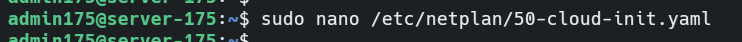
> 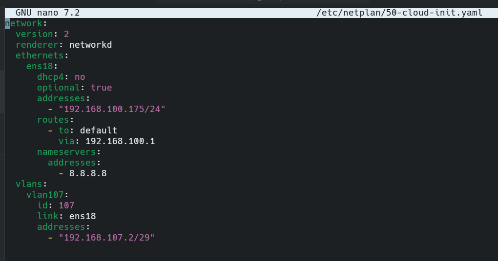
> 

### 1.2 Verificación de Interfaces de Red

```bash
ip addr show
```

> 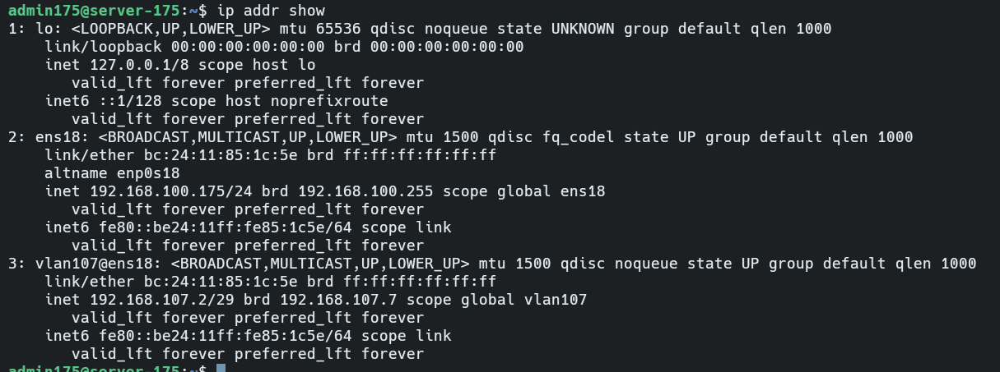


---

### 1.3 Verificación de Conectividad con las demás VMs

```bash
ping -c 3 192.168.107.3   # App 1 - Daner
ping -c 3 192.168.107.4   # App 2 - Melany
ping -c 3 192.168.107.5   # DB - Limbert
```

> 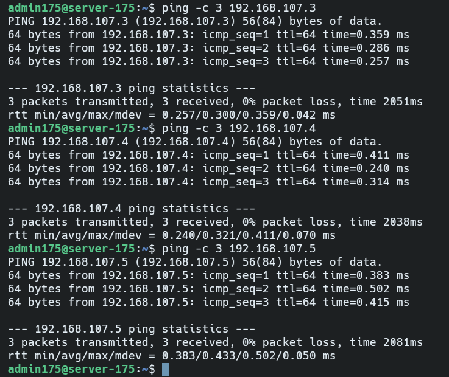


---

## 2. Proxy Inverso — Nginx

### 2.1 Instalación

```bash
sudo apt update && sudo apt install nginx -y
```
> 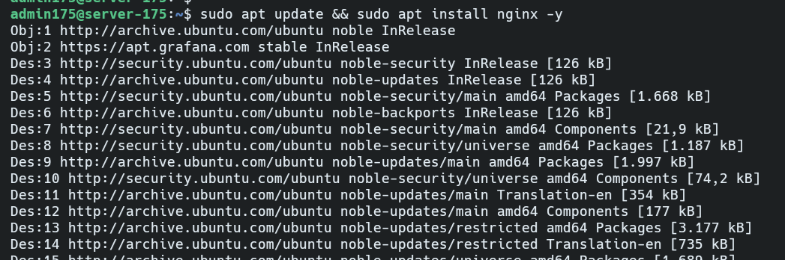


### 2.2 Configuración del Balanceador de Carga

Se editó el archivo de configuración de Nginx:

```bash
sudo nano /etc/nginx/sites-available/default
```
> 


Contenido aplicado:

```nginx
upstream loadbalancer {
    server 192.168.107.3:3000;  # App 1 - Daner
    server 192.168.107.4:3000;  # App 2 - Melany
}

server {
    listen 80;
    server_name _;

    location / {
        proxy_pass http://loadbalancer;
        proxy_set_header Host $host;
        proxy_set_header X-Real-IP $remote_addr;
        proxy_set_header X-Forwarded-For $proxy_add_x_forwarded_for;
    }
}
```

> 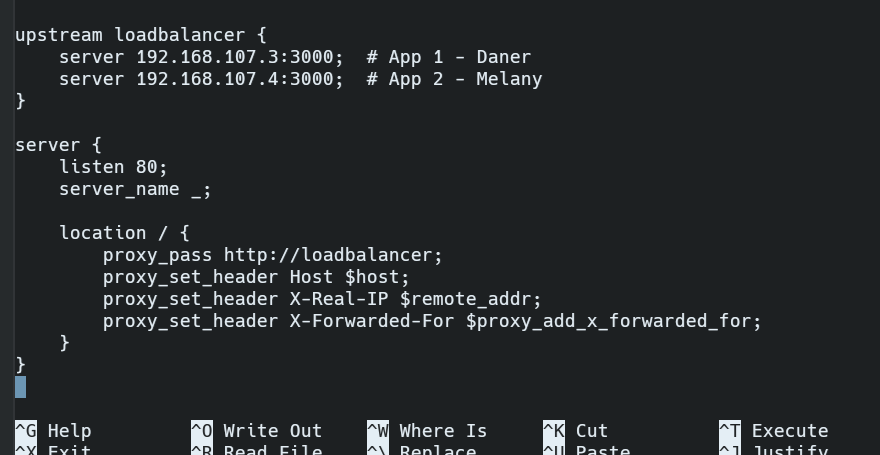

### 2.3 Verificación de Configuración de Nginx

```bash
sudo nginx -t
```

> 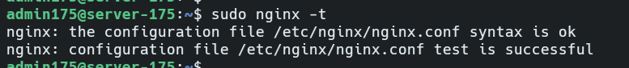


```bash
sudo systemctl restart nginx
sudo systemctl enable nginx
```

### 2.4 Verificación del Estado de Nginx

```bash
sudo systemctl status nginx
```

> 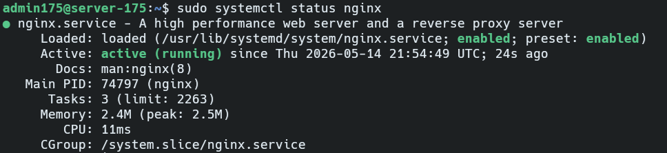

---

## 3. Monitoreo — Prometheus

### 3.1 Instalación de Prometheus y Node Exporter

```bash
sudo apt install prometheus prometheus-node-exporter -y
```
> 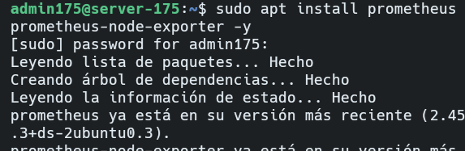

### 3.2 Configuración de Scrape Targets

Se editó el archivo de configuración de Prometheus:

```bash
sudo nano /etc/prometheus/prometheus.yml
```
> 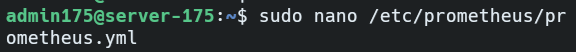

Sección `scrape_configs` aplicada:

```yaml
scrape_configs:
  - job_name: 'prometheus'
    static_configs:
      - targets: ['localhost:9090']

  - job_name: 'node-proxy'
    static_configs:
      - targets: ['192.168.107.2:9100']

  - job_name: 'node-app1'
    static_configs:
      - targets: ['192.168.107.3:9100']

  - job_name: 'node-app2'
    static_configs:
      - targets: ['192.168.107.4:9100']

  - job_name: 'node-db'
    static_configs:
      - targets: ['192.168.107.5:9100']
```
> 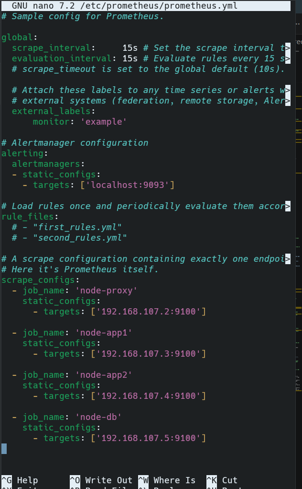

```bash
sudo systemctl restart prometheus
sudo systemctl enable prometheus
```
> 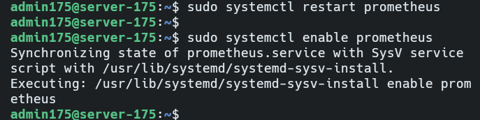

### 3.3 Verificación del Estado de Prometheus

```bash
sudo systemctl status prometheus
```

> 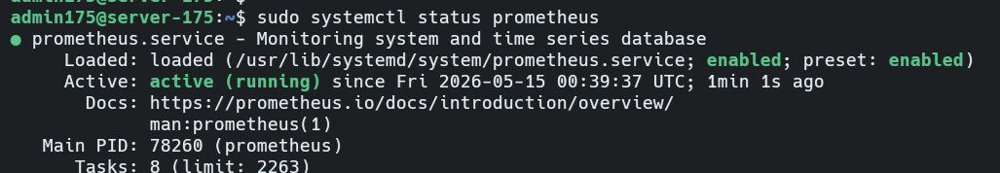
---

## 4. Monitoreo — Grafana

### 4.1 Instalación

```bash
sudo apt-get install -y apt-transport-https software-properties-common wget
```
> 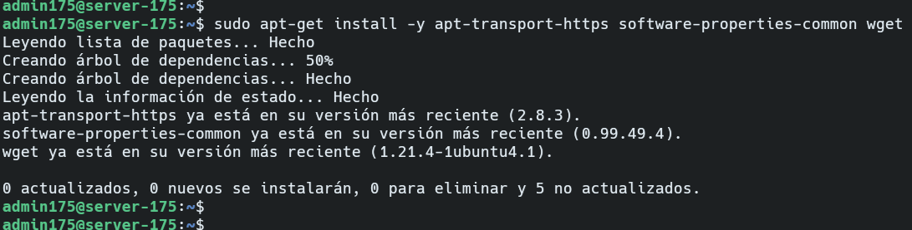
```bash
sudo mkdir -p /etc/apt/keyrings/
wget -q -O - https://apt.grafana.com/gpg.key | gpg --dearmor | sudo tee /etc/apt/keyrings/grafana.gpg > /dev/null
```
> 
> 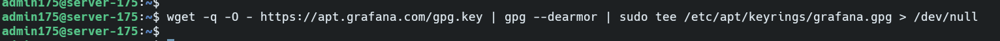


```bash
echo "deb [signed-by=/etc/apt/keyrings/grafana.gpg] https://apt.grafana.com stable main" | sudo tee -a /etc/apt/sources.list.d/grafana.list
```
> 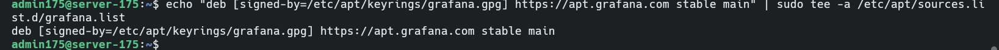

```bash
sudo apt update
sudo apt install grafana -y
sudo systemctl daemon-reload
sudo systemctl enable grafana-server
sudo systemctl start grafana-server
```
> 

### 4.2 Verificación del Estado de Grafana

```bash
sudo systemctl status grafana-server
```
> 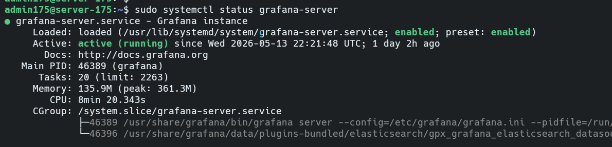


### 4.3 Configuración de Data Source en Grafana

Se accedió a Grafana desde el navegador:  
**https://vlan107-monitoring.rootcode.com.bo**

Pasos realizados:
1. Inicio de sesión con usuario `admin`
2. Cambio de contraseña inicial
3. Navegación a **Connections → Data Sources → Add data source → Prometheus**
4. URL configurada: `http://localhost:9090`
5. Clic en **Save & Test**

> 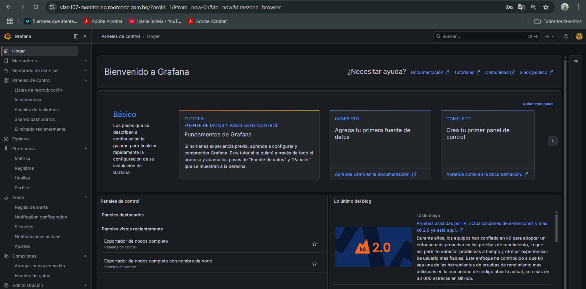

### 4.4 Importación de Dashboards

Se importaron los siguientes dashboards:

| Dashboard | ID |
|-----------|----|
| Node Exporter Full | `1860` |
| Node Exporter Full with Node Name | `10242` |

Pasos: **Dashboards → Import → ingresar ID → Load → Import**

> 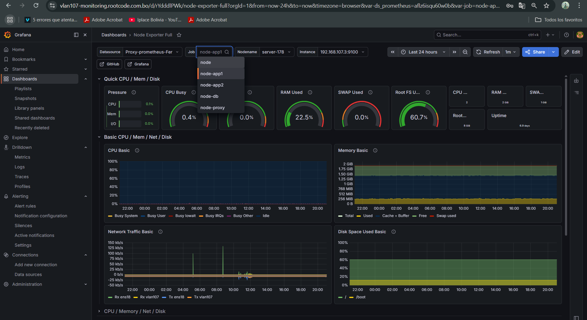
> 

---

## 5. Pruebas de Balanceo de Carga

### 5.1 Verificación directa a cada App

```bash
curl http://192.168.107.3:3000/movies
curl http://192.168.107.4:3000/movies
```
> 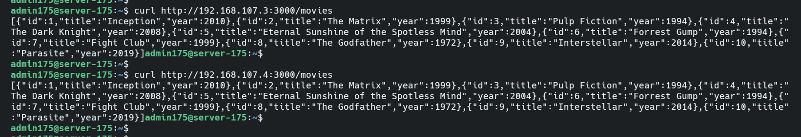


### 5.2 Verificación del Balanceo a través del Proxy

```bash
curl http://192.168.107.2/movies
curl http://192.168.107.2/movies
curl http://192.168.107.2/movies
curl http://192.168.107.2/movies
```
> 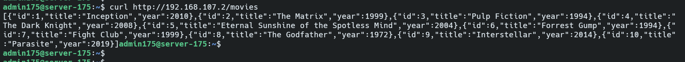


### 5.3 Verificación de la Pagina ddel balanceador

Se accedio desde cualquier dicpositivo para ver 

**https://vlan107-app.rootcode.com.bo/**
> 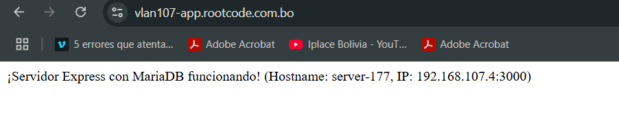
> 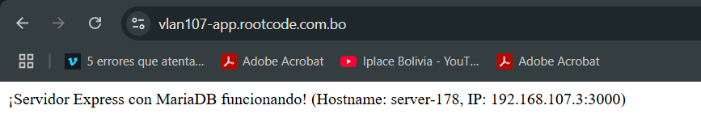


### 5.3 Verificación de la Pagina de la base de datos

Se accedio desde cualquier dicpositivo para ver 

**https://vlan107-app.rootcode.com.bo/movies/**
> 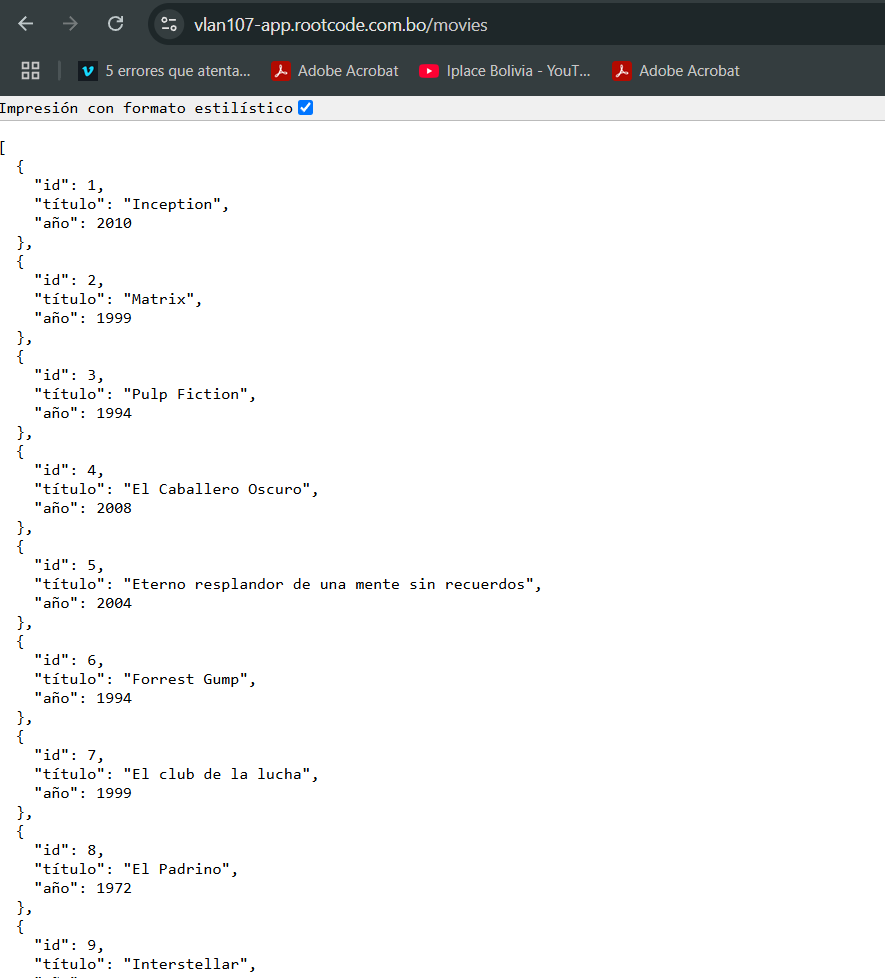


### 5.4 Prueba de Failover

Se detuvo una de las aplicaciones para verificar la alta disponibilidad:

```bash
# Ejecutado en la VM de Daner (App 1)
pm2 stop app1_3000
```

Desde el proxy se verificó que el tráfico continúa:

```bash
for i in $(seq 1 6); do curl -s http://192.168.107.2/movies; echo "---"; done
```

> 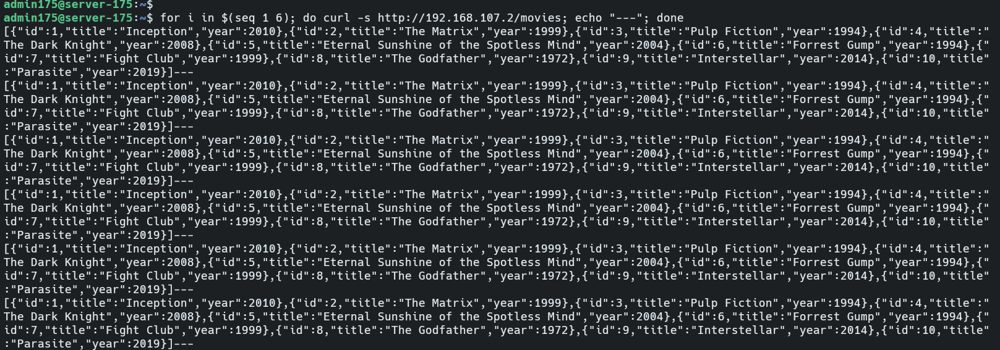

```bash
# Restaurar App 1
pm2 start app1_3000
```

---

## 6. Conclusiones

- Se implementó exitosamente un proxy inverso con Nginx que balancea el tráfico entre dos instancias de aplicación (App 1 en `192.168.107.3` y App 2 en `192.168.107.4`) usando el algoritmo round-robin por defecto.

- Se configuró Prometheus para recolectar métricas de las 4 VMs del grupo a través del puerto `9100` de Node Exporter, permitiendo una visibilidad completa del estado del sistema.

- Se integró Grafana como capa de visualización, importando dashboards estándar que muestran en tiempo real el uso de CPU, memoria, disco y red de cada nodo.

- La prueba de failover demostró que la arquitectura cumple con el objetivo de Alta Disponibilidad: al caer una instancia de aplicación, el proxy redirige automáticamente el 100% del tráfico a la instancia disponible sin interrupción del servicio.