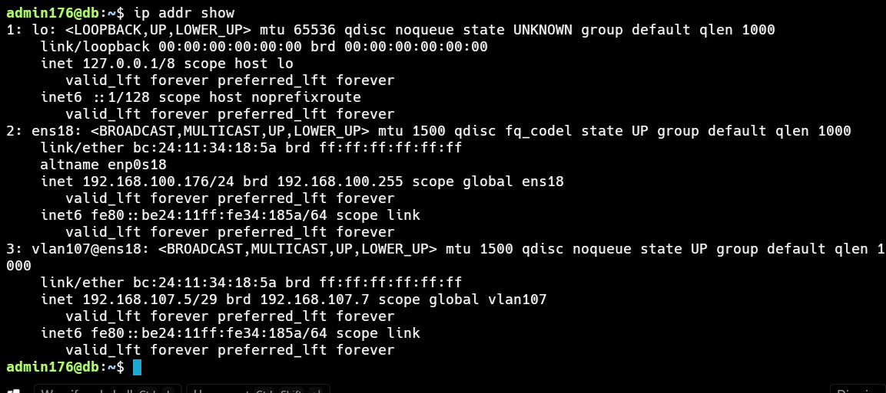
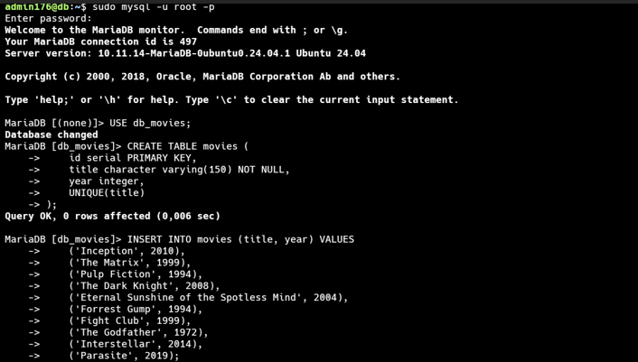
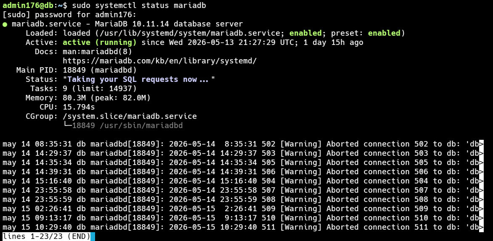
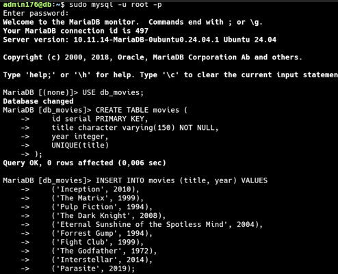
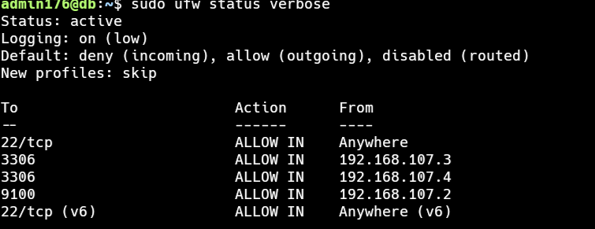
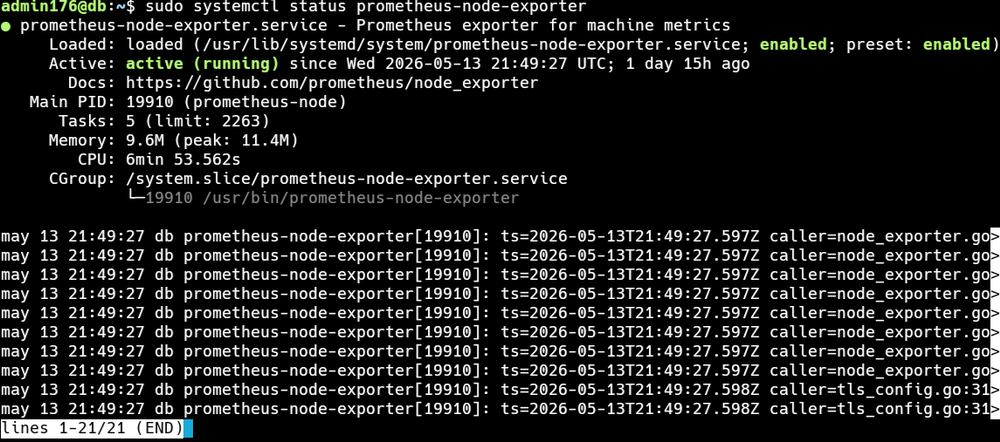

# 📝 Informe — Base de Datos

**Universidad San Francisco Xavier de Chuquisaca**  
**Asignatura:** Infraestructura, Plataformas Tecnológicas y Redes (SIS313)  
**Docente:** Ing. Marcelo Quispe Ortega  
**Semestre:** 1/2026  
**Integrante:** Limbert Mamani Isla
**Rol:** BASE DE DATOS  
**IP SSH:** `192.168.100.176` | **IP VLAN 107:** `192.168.107.5`

---

## 1. Configuración de Red

### 1.1 Configuración IP Estática con VLAN 107

Se editó el archivo de configuración de red:

```bash
sudo nano /etc/netplan/50-cloud-init.yaml
```

Contenido aplicado:

```yaml
network:
  version: 2
  renderer: networkd
  ethernets:
    ens18:
      dhcp4: no
      optional: true
      addresses:
        - "192.168.100.176/24"
      routes:
        - to: default
          via: 192.168.100.1
      nameservers:
        addresses:
          - 8.8.8.8
  vlans:
    vlan107:
      id: 107
      link: ens18
      addresses:
        - "192.168.107.5/29"
```

```bash
sudo netplan apply
```

### 1.2 Verificación de Interfaces de Red

```bash
ip addr show
```
> 

---

### 1.3 Verificación de Conectividad con las demás VMs

```bash
ping -c 3 192.168.107.2   # Proxy - Fernando
ping -c 3 192.168.107.3   # App 1 - Daner
ping -c 3 192.168.107.4   # App 2 - Melany
```

---

## 2. Instalación de MariaDB

```bash
sudo apt update && sudo apt install mariadb-server -y
```

---

## 3. Hardening de MariaDB

```bash
sudo mysql_secure_installation
```

Respuestas aplicadas:

```
Enter current password for root (enter for none):     [ENTER]
Switch to unix_socket authentication [Y/n]:            [ENTER]
Change the root password? [Y/n]:                       [ENTER]
New password:                                          [contraseña establecida]
Re-enter new password:                                 [contraseña repetida]
Remove anonymous users? [Y/n]:                         [ENTER]
Disallow root login remotely? [Y/n]:                   [ENTER]
Remove test database and access to it? [Y/n]:          [ENTER]
Reload privilege tables now? [Y/n]:                    [ENTER]
```

### 3.1 Verificación de Acceso con Root

```bash
mysql -u root -h localhost -p
```

```sql
quit
```

> 

---

## 4. Configuración de Acceso Remoto

Se editó el archivo de configuración de MariaDB:

```bash
sudo nano /etc/mysql/mariadb.conf.d/50-server.cnf
```

Se reemplazó la línea:

```
bind-address = 127.0.0.1
```

Por:

```
bind-address = 192.168.107.5
```

```bash
sudo systemctl restart mariadb
sudo systemctl enable mariadb
```

### 4.1 Verificación del Estado de MariaDB

```bash
sudo systemctl status mariadb
```

>  

### 4.2 Verificación del Puerto Escuchando en la IP Correcta

```bash
ss -tlnp | grep 3306
```

> 

---

## 5. Creación de Base de Datos, Usuario y Permisos

```bash
mysql -u root -h localhost -p
```

```sql
CREATE DATABASE db_movies;
```

```sql
CREATE USER 'usr_movies'@'192.168.107.3' IDENTIFIED BY 'secret';
```

```sql
CREATE USER 'usr_movies'@'192.168.107.4' IDENTIFIED BY 'secret';
```

```sql
GRANT ALL PRIVILEGES ON db_movies.* TO 'usr_movies'@'192.168.107.3';
```

```sql
GRANT ALL PRIVILEGES ON db_movies.* TO 'usr_movies'@'192.168.107.4';
```

```sql
FLUSH PRIVILEGES;
```

```sql
quit
```

### 5.1 Verificación de Usuarios Creados

```bash
mysql -u root -p -e "SELECT user, host FROM mysql.user WHERE user='usr_movies';"
```

> 

---

## 6. Creación de Tabla e Inserción de Datos

Se accedió con el nuevo usuario:

```bash
mysql -u usr_movies -h 192.168.107.5 -p
```

```sql
USE db_movies;
```

```sql
CREATE TABLE movies (
    id serial PRIMARY KEY,
    title character varying(150) NOT NULL,
    year integer,
    UNIQUE(title)
);
```

```sql
INSERT INTO movies (title, year) VALUES
    ('Inception', 2010),
    ('The Matrix', 1999),
    ('Pulp Fiction', 1994),
    ('The Dark Knight', 2008),
    ('Eternal Sunshine of the Spotless Mind', 2004),
    ('Forrest Gump', 1994),
    ('Fight Club', 1999),
    ('The Godfather', 1972),
    ('Interstellar', 2014),
    ('Parasite', 2019);
```

### 6.1 Verificación de Datos Insertados

```sql
SELECT * FROM movies;
```

```sql
quit
```

---

## 7. Hardening UFW (Firewall)

```bash
sudo apt install ufw -y
```

```bash
sudo ufw allow ssh
sudo ufw allow from 192.168.107.3 to any port 3306
sudo ufw allow from 192.168.107.4 to any port 3306
sudo ufw allow from 192.168.107.2 to any port 9100
sudo ufw enable
```

### 7.1 Verificación de Reglas UFW

```bash
sudo ufw status verbose
```

>  — Resultado de `ufw status verbose` mostrando las reglas activas: puerto 3306 permitido solo desde `.3` y `.4`, y puerto 9100 solo desde `.2`.

---

## 8. Instalación de Node Exporter

```bash
sudo apt install prometheus-node-exporter -y
```

```bash
curl http://localhost:9100/metrics | head -20
```

### 8.1 Verificación del Estado de Node Exporter

```bash
sudo systemctl status prometheus-node-exporter
```

>  — Resultado mostrando Node Exporter como `active (running)` y las primeras líneas de métricas expuestas.

---

## 9. Conclusiones

- Se instaló y configuró MariaDB correctamente, cambiando el `bind-address` a la IP de la VLAN `192.168.107.5` para permitir conexiones remotas desde las VMs de aplicación.

- Se creó la base de datos `db_movies` con el usuario `usr_movies` con permisos restringidos únicamente a las IPs de App 1 (`192.168.107.3`) y App 2 (`192.168.107.4`), aplicando el principio de mínimo privilegio.

- Se aplicó hardening con UFW bloqueando el acceso al puerto 3306 desde cualquier IP que no sea las de las aplicaciones, aumentando la seguridad del servidor de base de datos.

- Se instaló Node Exporter en el puerto 9100 para exponer métricas del sistema operativo, permitiendo al servidor de monitoreo (Prometheus en `192.168.107.2`) recolectar datos de esta VM.